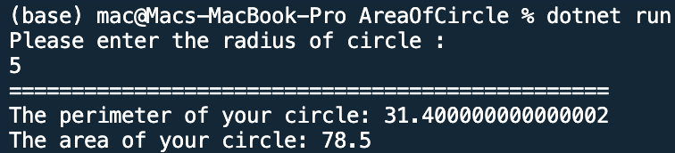

## Area and Perimeter of Circle

Name: Program to calculate Area and Perimeter of Circle

Date: Feb 24th, 2024

## Source Code

```csharp // See https://aka.ms/new-console-template for more information
using System;

namespace AreaOfCircle
{
    class Program{
        static void Main(string[]  args){
            double r, perimeter, area;
            Console.WriteLine("Please enter the radius of circle :");

            r = Convert.ToDouble(Console.ReadLine());
            perimeter = 2 * 3.14 * r;
            area = 3.14 * Math.Pow(r, 2); // area  =  3.14 * r * r;
            Console.WriteLine("================================================");
            Console.WriteLine("The perimeter of your circle: {0}", perimeter);
            Console.WriteLine("The area of your circle: {0}", area);
            Console.ReadLine();
        }
    }
}
```

## Output


