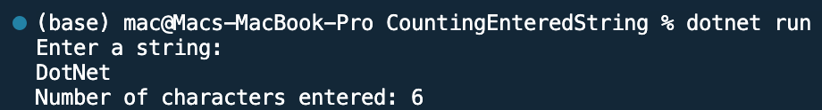

## Counting String in Entered 

Name: Program to count character in an string

Date: Feb 24th, 2024

## Source Code

```csharp // See https://aka.ms/new-console-template for more information
using System;

class Program
{
    static void Main()
    {
        Console.WriteLine("Enter a string:");
        string input = Console.ReadLine();

        int characterCount = CountCharacters(input);

        Console.WriteLine($"Number of characters entered: {characterCount}");
    }

    static int CountCharacters(string input)
    {
        // Use the Length property of the string to get the number of characters
        return input.Length;
    }
}

```

## Output

