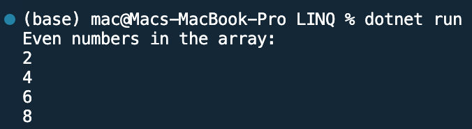

## Program to print even number using LINQ

Name: Program to print even number using LINQ

Date: Mar 4th, 2024

## Source Code

```csharp // See https://aka.ms/new-console-template for more information
using System;
using System.Linq;

class Program
{
    static void Main(string[] args)
    {
        int[] numbers = { 2, 3, 4, 5, 6, 7, 8, 9 };

        // Use LINQ to find all even numbers in the array
        var evenNumbers = from n in numbers
                        where n % 2 == 0
                        select n;

        Console.WriteLine("Even numbers in the array:");
        foreach (int num in evenNumbers)
        {
            Console.WriteLine(num);
        }
        Console.WriteLine("\n");
    }
}
```

## Output


