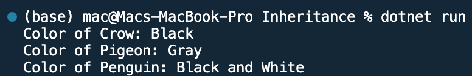

## Program to create a class name Bird and display the color of Crow, Pigeon and Penguin

Name: Program to create a class name Bird and display the color of Crow, Pigeon and Penguin

Date: Feb 28th, 2024

## Source Code

```csharp // See https://aka.ms/new-console-template for more information
using System;

class Bird
{
    public string Color { get; set; }

    // Constructor
    public Bird(string color)
    {
        Color = color;
    }
}

class Display
{
    public static void DisplayBirdColor(string birdType, string color)
    {
        Console.WriteLine($"Color of {birdType}: {color}");
    }
}

class Program
{
    static void Main(string[] args)
    {
        // Create instances of Bird class for crow, pigeon, and penguin
        Bird crow = new Bird("Black");
        Bird pigeon = new Bird("Gray");
        Bird penguin = new Bird("Black and White");

        // Display colors of crow, pigeon, and penguin using Display class
        Display.DisplayBirdColor("Crow", crow.Color);
        Display.DisplayBirdColor("Pigeon", pigeon.Color);
        Display.DisplayBirdColor("Penguin", penguin.Color);
    }
}

```

## Output


