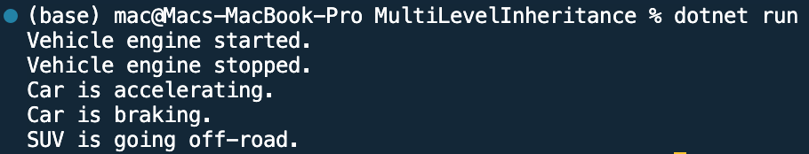

## Program to illustrate Multi Level inheritance

Name: Program to illustrate Multi Level inheritance

Date: Feb 28th, 2024

## Source Code

```csharp // See https://aka.ms/new-console-template for more information
using System;

// Base class
public class Vehicle
{
    public void Start()
    {
        Console.WriteLine("Vehicle engine started.");
    }

    public void Stop()
    {
        Console.WriteLine("Vehicle engine stopped.");
    }
}

// Derived class inheriting from Vehicle
public class Car : Vehicle
{
    public void Accelerate()
    {
        Console.WriteLine("Car is accelerating.");
    }

    public void Brake()
    {
        Console.WriteLine("Car is braking.");
    }
}

// Another class inheriting from Car
public class SUV : Car
{
    public void OffRoad()
    {
        Console.WriteLine("SUV is going off-road.");
    }
}

class Program
{
    static void Main(string[] args)
    {
        SUV suv = new SUV();

        // Accessing methods from Vehicle class
        suv.Start(); // Output: Vehicle engine started.
        suv.Stop();  // Output: Vehicle engine stopped.

        // Accessing methods from Car class
        suv.Accelerate(); // Output: Car is accelerating.
        suv.Brake();       // Output: Car is braking.

        // Accessing method from SUV class
        suv.OffRoad(); // Output: SUV is going off-road.
    }
}

```

## Output


