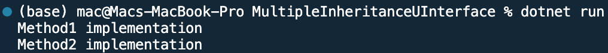

## Program to display data using mutilple inheritance through interface

Name: Program to display data using mutilple inheritance through interface

Date: Feb 29th, 2024

## Source Code

```csharp // See https://aka.ms/new-console-template for more information
using System;

// Define interfaces
public interface IFirst
{
    void Method1();
}

public interface ISecond
{
    void Method2();
}

// Implement interfaces in classes
public class MyClass : IFirst, ISecond
{
    public void Method1()
    {
        Console.WriteLine("Method1 implementation");
    }

    public void Method2()
    {
        Console.WriteLine("Method2 implementation");
    }
}

class Program
{
    static void Main(string[] args)
    {
        // Create an instance of MyClass
        MyClass myObj = new MyClass();

        // Call methods from both interfaces
        myObj.Method1(); // Output: Method1 implementation
        myObj.Method2(); // Output: Method2 implementation
    }
}

```

## Output


