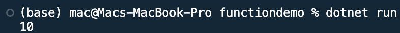

## Program to use a function 

Name: Program to use a function

Date: Feb 24th, 2024

## Source Code

```csharp // See https://aka.ms/new-console-template for more information
uusing System;
namespace functiondemo
{
    class Program
    {
        static void Main(string[] args)
        {
            int a = 10;
            UpdateValue(a);
            Console.WriteLine(a);
            Console.ReadKey();
        }
        private static void UpdateValue(int b)
        {
            b = 30;
        }
    }
}

```

## Output


