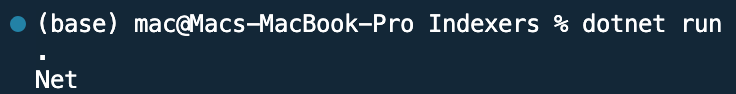

## Program to use Indexers in C#

Name: Program to use Indexers in C#

Date: Feb 28th, 2024

## Source Code

```csharp // See https://aka.ms/new-console-template for more information
using System;

public class MyIndexerExample
{
    private string[] data = new string[5]; // Some internal data storage

    // Indexer declaration
    public string this[int index]
    {
        get
        {
            // Retrieve value at index
            return data[index];
        }
        set
        {
            // Set value at index
            data[index] = value;
        }
    }
}

class Program
{
    static void Main(string[] args)
    {
        MyIndexerExample example = new MyIndexerExample();

        // Using the indexer to set values
        example[0] = ".";
        example[1] = "Net";

        // Using the indexer to get values
        Console.WriteLine(example[0]); // Output: .(Dot)
        Console.WriteLine(example[1]); // Output: Net
    }
}

```

## Output


