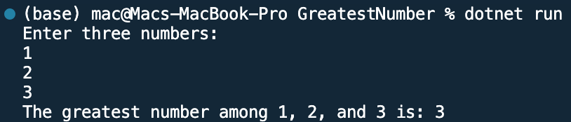

## Program to find greatest number among 3 numbers

Name: Program to find greatest number among 3 numbers

Date: Feb 28th, 2024

## Source Code

```csharp // See https://aka.ms/new-console-template for more information
using System;

class Program
{
    static void Main(string[] args)
    {
        // Input three numbers
        Console.WriteLine("Enter three numbers:");
        int num1 = Convert.ToInt32(Console.ReadLine());
        int num2 = Convert.ToInt32(Console.ReadLine());
        int num3 = Convert.ToInt32(Console.ReadLine());

        // Find the greatest number using conditional operators
        int greatest = (num1 > num2) ? ((num1 > num3) ? num1 : num3) : ((num2 > num3) ? num2 : num3);

        // Print the greatest number
        Console.WriteLine($"The greatest number among {num1}, {num2}, and {num3} is: {greatest}");
    }
}

```

## Output


