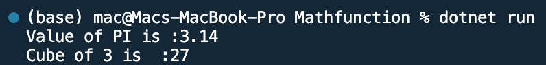

## Program to use Math function in C#

Name: Program to use Math function

Date: Feb 24th, 2024

## Source Code

```csharp // See https://aka.ms/new-console-template for more information
using System;

public static class MyMath
{
    public static float PI = 3.14f;
    public static int cube(int n) {return n * n * n;}
}

class TestMyMath
{
    public static void Main(string[] args)
    {
        Console.WriteLine("Value of PI is :" + MyMath.PI);
        Console.WriteLine("Cube of 3 is  :" + MyMath.cube(3));
    }
}
```

## Output


