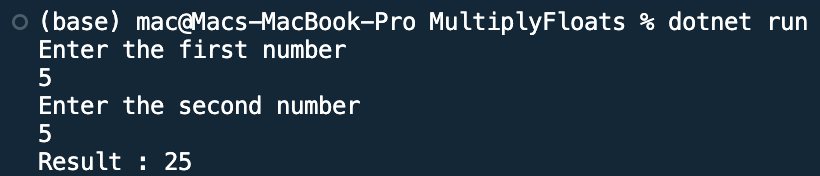

## Program to multiply float data entered by user

Name: Program to multiply float data entered by user

Date: Feb 26th, 2024

## Source Code

```csharp // See https://aka.ms/new-console-template for more information
using System;

namespace MultiplyFloat
{
    class Program
    {
        static void Main(string[] args)
        {
            Console.WriteLine("Enter the first number");
            float first = Convert.ToInt32(Console.ReadLine());
            Console.WriteLine("Enter the second number");
            float second = Convert.ToInt32(Console.ReadLine());
            float multiply = first * second;
            Console.WriteLine("Result : {0}", multiply);
            Console.ReadKey();
        }
    }
}
```

## Output


