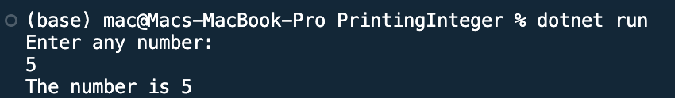

## Program to print an integer entered by user

Name: Program to print an integer entered by user

Date: Feb 24th, 2024

## Source Code

```csharp // See https://aka.ms/new-console-template for more information
using System;

namespace PrintingInteger
{
    class Programcs
    {
        static void Main(string[] args)
        {
            Console.WriteLine("Enter any number:");
            int num = Convert.ToInt32(Console.ReadLine());
            Console.WriteLine("The number is {0}", num);
            Console.ReadKey();
        }
    }
}
```

## Output


