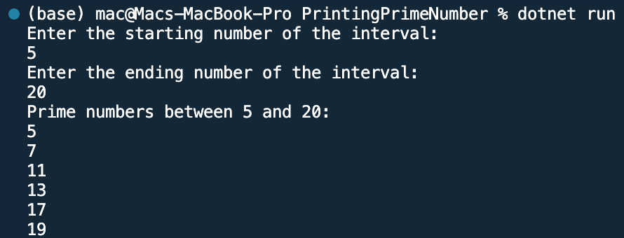

## Program to print prime number in an internal entered by user

Name: Program to print prime number in an internal entered by user

Date: Feb 27th, 2024

## Source Code

```csharp // See https://aka.ms/new-console-template for more information
using System;

class Program
{
    static void Main(string[] args)
    {
        Console.WriteLine("Enter the starting number of the interval:");
        int start = Convert.ToInt32(Console.ReadLine());

        Console.WriteLine("Enter the ending number of the interval:");
        int end = Convert.ToInt32(Console.ReadLine());

        Console.WriteLine($"Prime numbers between {start} and {end}:");

        // Iterate through the interval
        for (int i = start; i <= end; i++)
        {
            if (IsPrime(i))
            {
                Console.WriteLine(i);
            }
        }
    }
    // Method to check if a number is prime
    static bool IsPrime(int num)
    {
        if (num <= 1)
        {
            return false;
        }
        for (int i = 2; i <= Math.Sqrt(num); i++)
        {
            if (num % i == 0)
            {
                return false;
            }
        }
        return true;
    }
}

```

## Output


