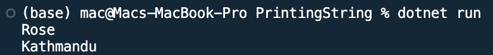

## Program to use print string in C#

Name: Program to print string

Date: Feb 24th, 2024

## Source Code

```csharp // See https://aka.ms/new-console-template for more information
using System;

namespace PrintingString
{
    class Program
    {
        static void Main(string[] args)
        {
            string name = "Rose";
            string address = "Kathmandu";
            Console.WriteLine(name);
            Console.WriteLine(address);
            Console.ReadLine();
        }
    }
}
```

## Output


