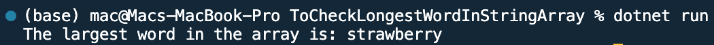

## Program to find the longest word in an string array

Name: Program to find the longest word in an string array

Date: Feb 24th, 2024

## Source Code

```csharp // See https://aka.ms/new-console-template for more information
using System;

class Program
{
    static void Main(string[] args)
    {
        // Input string array
        string[] words = { "apple", "banana", "orange", "strawberry", "kiwi" };

        // Find the largest word
        string largestWord = FindLargestWord(words);

        // Output result
        Console.WriteLine($"The largest word in the array is: {largestWord}");
    }

    // Method to find the largest word in a string array
    static string FindLargestWord(string[] arr)
    {
        string largestWord = arr[0];
        foreach (string word in arr)
        {
            if (word.Length > largestWord.Length)
            {
                largestWord = word;
            }
        }
        return largestWord;
    }
}

```

## Output


