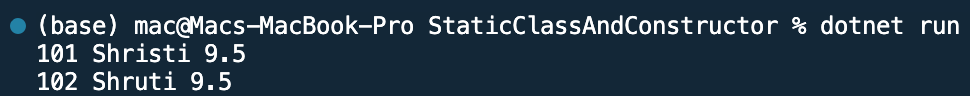

## Program to use static class and constructor

Name: Program to use static class and constructor

Date: Feb 24th, 2024

## Source Code

```csharp // See https://aka.ms/new-console-template for more information
//Example of static constructors and static class in C# 
using System;
namespace StaticClassAndConstructor
{
    public class Account
    {
        public int id;
        public string name;
        public static float rateOfInterest;
        public Account(int id, string name)
        {
            this.id = id;
            this.name = name;
        }
        static Account()
        {
            rateOfInterest = 9.5f;
        }
        public void display()
        {
            Console.WriteLine(id + " " + name + " " + rateOfInterest);
        }
        class TestEmployee
        {
            public static void Main(string[] args)
            {
                Account a1 = new Account(101, "Shristi");
                Account a2 = new Account(102, "Shruti");
                a1.display();
                a2.display();
            }
        }
    } 
}
```

## Output


