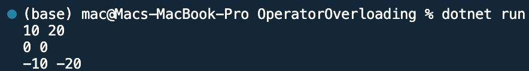

## Program to Overload operator

Name: Program to overload operator

Date: Feb 24th, 2024

## Source Code

```csharp // See https://aka.ms/new-console-template for more information
using System;
using System.Numerics;

class Complex
{
    private int x;
    private int y;
    public Complex()
    {

    }
    public Complex(int i, int j)
    {
        x = i;
        y = j;
    }
    public void ShowXY()
    {
        Console.WriteLine("{0} {1}", x, y);
    }
    public static Complex operator -(Complex c)
    {
        Complex temp = new Complex();
        temp.x =  -c.x;
        temp.y = -c.y;
        return temp;
    }
    public static void Main(string[] args)
    {
        Complex c1 = new Complex(10, 20);
        c1.ShowXY();
        Complex c2 = new Complex();
        c2.ShowXY();
        c2 = -c1;
        c2.ShowXY();
    }
}
```

## Output


