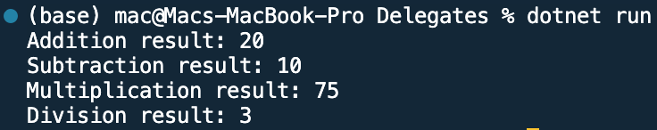

## Program to use Delegates in C#

Name: Program to use Delegates in C#

Date: Feb 29th, 2024

## Source Code

```csharp // See https://aka.ms/new-console-template for more information
using System;

// Declare a delegate type
delegate void MathOperation(int x, int y);

class Calculator
{
    // Methods that match the signature of the delegate
    public static void Add(int x, int y)
    {
        Console.WriteLine($"Addition result: {x + y}");
    }

    public static void Subtract(int x, int y)
    {
        Console.WriteLine($"Subtraction result: {x - y}");
    }

    public static void Multiply(int x, int y)
    {
        Console.WriteLine($"Multiplication result: {x * y}");
    }

    public static void Divide(int x, int y)
    {
        if (y != 0)
        {
            Console.WriteLine($"Division result: {x / y}");
        }
        else
        {
            Console.WriteLine("Cannot divide by zero.");
        }
    }
}

class Program
{
    static void Main(string[] args)
    {
        // Instantiate the delegate with the methods
        MathOperation mathOp = Calculator.Add;
        mathOp += Calculator.Subtract;
        mathOp += Calculator.Multiply;
        mathOp += Calculator.Divide;

        // Invoke the delegate
        mathOp(15, 5);
    }
}

```

## Output


