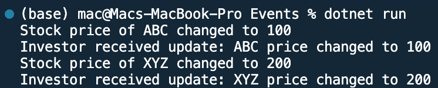

## Program to use Events in C#

Name: Program to use Events in C#

Date: Feb 29th, 2024

## Source Code

```csharp // See https://aka.ms/new-console-template for more information
using System;

// Event delegate
public delegate void SharePriceChangedEventHandler(string shareName, double newPrice);

// Publisher class
public class StockMarket
{
    // Event declaration
    public event SharePriceChangedEventHandler? SharePriceChanged;

    // Method to simulate changing stock prices
    public void SimulateSharePriceChange(string shareName, double newPrice)
    {
        Console.WriteLine($"Stock price of {shareName} changed to {newPrice}");
        // Raise the event
        SharePriceChanged?.Invoke(shareName, newPrice);
    }
}

// Subscriber class
public class Investor
{
    // Event handler method
    public void OnSharePriceChanged(string shareName, double newPrice)
    {
        Console.WriteLine($"Investor received update: {shareName} price changed to {newPrice}");
    }
}

class Program
{
    static void Main(string[] args)
    {
        // Create instances of publisher and subscriber
        StockMarket market = new StockMarket();
        Investor investor = new Investor();

        // Subscribe to the event
        market.SharePriceChanged += investor.OnSharePriceChanged;

        // Simulate stock price changes
        market.SimulateSharePriceChange("ABC", 100);
        market.SimulateSharePriceChange("XYZ", 200);
    }
}

```

## Output


