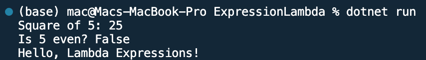

## Program to implement Expression Lambda

Name: Program to implement Expression Lambda

Date: Mar 2nd, 2024

## Source Code

```csharp // See https://aka.ms/new-console-template for more information

using System;

class Program
{
    static void Main(string[] args)
    {
        // Lambda expression to square a number
        Func<int, int> square = x => x * x;

        // Lambda expression to check if a number is even
        Predicate<int> isEven = x => x % 2 == 0;

        // Lambda expression to print a message
        Action<string> printMessage = message => Console.WriteLine(message);

        // Use lambda expressions
        int number = 5;
        Console.WriteLine($"Square of {number}: {square(number)}"); // Output: Square of 5: 25
        Console.WriteLine($"Is {number} even? {isEven(number)}");   // Output: Is 5 even? False
        printMessage("Hello, Lambda Expressions!");                 // Output: Hello, Lambda Expressions!
    }
}

```

## Output


