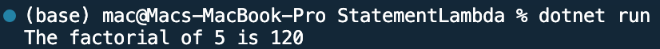

## Program to implement Statement Lambda

Name: Program to implement Statement Lambda

Date: Mar 3rd, 2024

## Source Code

```csharp // See https://aka.ms/new-console-template for more information
using System;

class Program
{
    static void Main(string[] args)
    {
        // Statement lambda to calculate the factorial of a number
        Func<int, long> factorial = n =>
        {
            long result = 1;
            for (int i = 2; i <= n; i++)
            {
                result *= i;
            }
            return result;
        };

        // Statement lambda to print a message with formatting
        Action<int> printMessage = x =>
        {
            Console.WriteLine($"The factorial of {x} is {factorial(x)}");
        };

        // Use statement lambdas
        int number = 5;
        printMessage(number); // Output: The factorial of 5 is 120
    }
}

```

## Output


