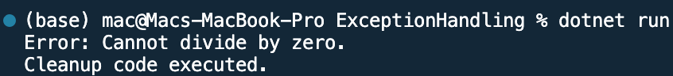

## Program to implement Exception Handling in C#

Name: Program to implement Exception Handling in C#

Date: Mar 3rd, 2024

## Source Code

```csharp // See https://aka.ms/new-console-template for more information
using System;

class Program
{
    static void Main(string[] args)
    {
        try
        {
            // Division by zero will cause an exception
            int result = Divide(10, 0);
            Console.WriteLine("Result: " + result); // This line will not be executed
        }
        catch (DivideByZeroException ex)
        {
            // Handle the specific exception
            Console.WriteLine("Error: " + ex.Message);
        }
        catch (Exception ex)
        {
            // Handle any other exceptions
            Console.WriteLine("An error occurred: " + ex.Message);
        }
        finally
        {
            // Cleanup code (optional)
            Console.WriteLine("Cleanup code executed.");
        }
    }

    static int Divide(int dividend, int divisor)
    {
        if (divisor == 0)
        {
            throw new DivideByZeroException("Cannot divide by zero.");
        }
        return dividend / divisor;
    }
}

```

## Output


