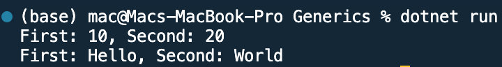

## Program to implement Generics in C#

Name: Program to implement Generics in C#

Date: Mar 3rd, 2024

## Source Code

```csharp // See https://aka.ms/new-console-template for more information
using System;

// Generic class definition for a pair of values
public class Pair<T>
{
    public T First { get; set; }
    public T Second { get; set; }

    // Constructor
    public Pair(T first, T second)
    {
        First = first;
        Second = second;
    }
}

class Program
{
    static void Main(string[] args)
    {
        // Create a Pair of integers
        Pair<int> intPair = new Pair<int>(10, 20);
        Console.WriteLine($"First: {intPair.First}, Second: {intPair.Second}");

        // Create a Pair of strings
        Pair<string> stringPair = new Pair<string>("Hello", "World");
        Console.WriteLine($"First: {stringPair.First}, Second: {stringPair.Second}");
    }
}

```

## Output


