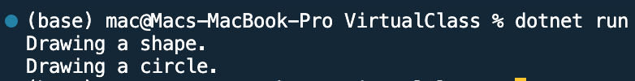

## Program to Virtual class and method  Lambda

Name: Program to Virtual class and method Lambda

Date: Mar 3rd, 2024

## Source Code

```csharp // See https://aka.ms/new-console-template for more information
using System;

// Base class with a virtual method
public class Shape
{
    public virtual void Draw()
    {
        Console.WriteLine("Drawing a shape.");
    }
}

// Derived class overriding the virtual method
public class Circle : Shape
{
    public override void Draw()
    {
        Console.WriteLine("Drawing a circle.");
    }
}

class Program
{
    static void Main(string[] args)
    {
        // Create instances of base and derived classes
        Shape shape = new Shape();
        Circle circle = new Circle();

        // Call the virtual method on both instances
        shape.Draw();  // Output: Drawing a shape.
        circle.Draw(); // Output: Drawing a circle.
    }
}

```

## Output


